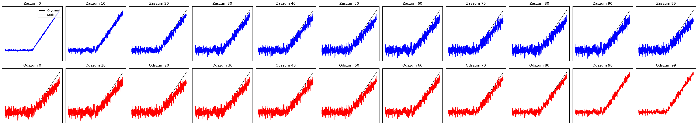
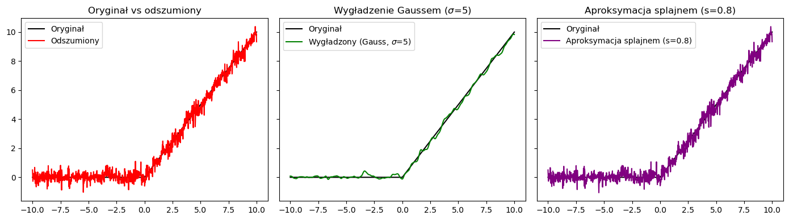
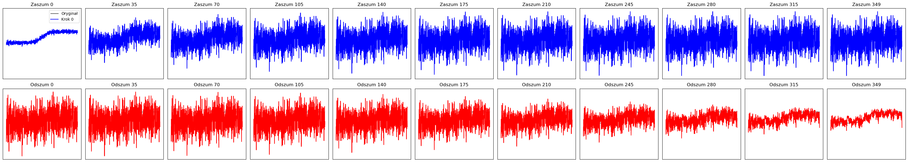
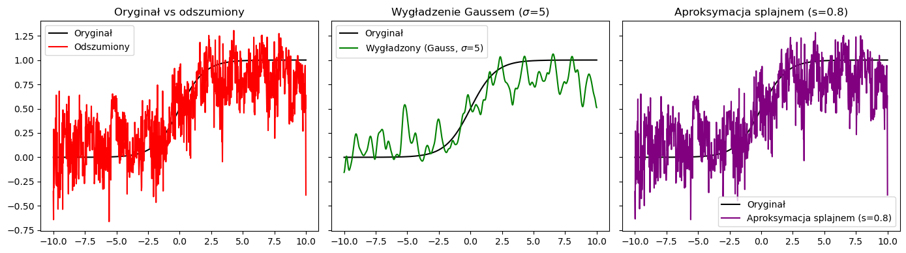
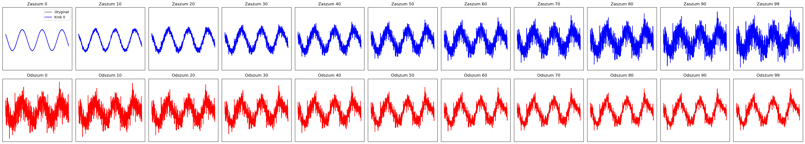
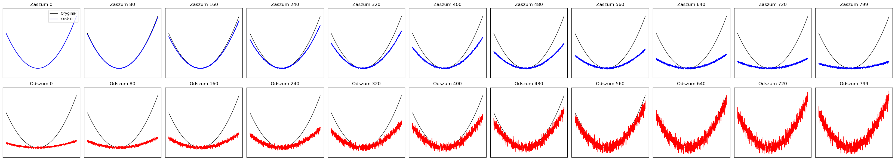
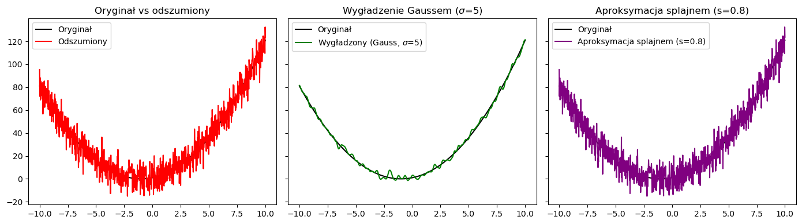

## Pracownia Problemowa

## Semestr 1

### Temat: Zastosowanie modeli dyfuzyjnych do matematycznych obliczeń (stablizacji/ poprawy)

### Opis:

Zaaplikowanie modeli dyfuzyjnych; zamiast do obrazów to na przykład do równań różniczkowych. Na filmiku https://www.coursera.org/learn/introduction-to-image-generation - jest wyjaśniona metoda działania dla obrazków (corseera plus jest za darmo za pierwszy 1 miesiąc). Pomysłów na zastosowanie samego pomysłu w matematyce jest dużo można zrobić poprawę dokładności wykresów (albo klasy wykresów) pochodzących od jakiś rozwiązań (niekoniecznie równań różniczkowych).

### Struktura katalogowa:

- `articles` - zbiór artykułów i notatki (będą uzupełniane)

- `unet_test` - zbudowano model UNet i dla 10 różnych funkcji, różnej liczby epok (1000, 5000, 10000), dla różnych liczby iteracji (100, 350, 800), różnych funkcji zaszumienia (linera, cosine, exp), dla różnych funkcji loss (mse, rmse, mae, mape) wytrenowano modele osobno i zbadano wyniki, dodatkowo zrobiono aproksymacje splajnami odszumionej funkcji i wygładzenie Guassowskie (dla obu policzono błędy względem odszumionej funkcji). Dla każdej liczby epok zapisano do pliku JSON wyniki poszczególnych wyników dla poszczególnych parametrów i podsumowano zestawieniem wyników w tabeli. W pliku `summary_all.ipynb` stworzono ranking dla poszczególnych parametrów.

- `UNetModele` - z innymi parametrmi (dla liczby iteracji T) wytrenowano i zapisano modele dla zbioru funkcji razem (tzn. zmienia się tylko liczba epok, liczbę iteracji, funkcja zaszumiania, MSE zostało użyte w każdym modelu). Nastepnie wygenerowano trzy różne funkcje, które są _zlepkiem_ tych użytych w trenowaniu i zbadano dla zapisanych modeli jak odbywa się proces odszumiania. Dodatkowo wykorystano użyte wcześniej funkcje wygładzania i aproksymacji.

### Przykładowy output:

Parametry:

- funkcja: relu,
- liczba epok: 10000,
- T: 100,
- beta: cosine,
- funkcja straty: MSE

Parametry:

- funkcja: sigmoid,
- liczba epok: 10000,
- T: 350,
- beta: cosine,
- funkcja straty: RMSE

Parametry:

- funkcja: sin,
- liczba epok: 10000,
- T: 100,
- beta: linear,
- funkcja straty: MAE

Parametry:

- funkcja: poly,
- liczba epok: 10000,
- T: 800,
- beta: linear,
- funkcja straty: MAPE

